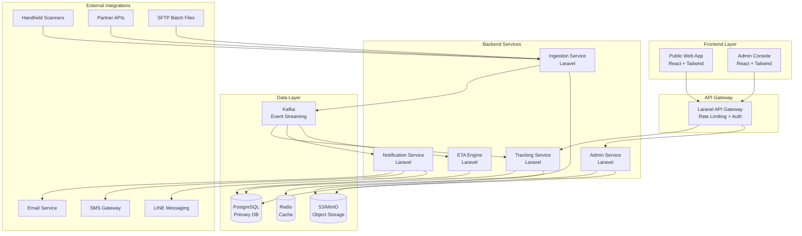

# Design Document

## Overview

The parcel tracking system is designed as a modern, scalable web application using Laravel for the backend API and React with Tailwind CSS for the frontend. The architecture follows microservices principles with clear separation between public tracking services, administrative functions, and data ingestion pipelines.

The system handles high-volume event ingestion from multiple sources (handheld scanners, partner APIs, batch files) while providing real-time tracking information to public users and comprehensive management tools for operations staff.

## Architecture

### High-Level Architecture



### Technology Stack

**Frontend:**
- React 18 with TypeScript for type safety
- Tailwind CSS for responsive design
- React Query for API state management and caching
- React Router for navigation
- React Hook Form for form handling
- i18next for internationalization (Thai/English)
- Leaflet for map visualization

**Backend:**
- Laravel 10 with PHP 8.2
- Laravel Sanctum for API authentication
- Laravel Horizon for queue management
- Laravel Scout for search functionality
- Spatie Laravel Permission for RBAC

**Infrastructure:**
- PostgreSQL 15 for primary database
- Redis 7 for caching and sessions
- Apache Kafka for event streaming
- MinIO/S3 for object storage
- Nginx as reverse proxy and load balancer

## Components and Interfaces

### Frontend Components

#### Public Tracking Interface

**TrackingForm Component:**
```typescript
interface TrackingFormProps {
  onSubmit: (trackingNumbers: string[]) => void;
  isLoading: boolean;
  maxNumbers: number;
}

interface TrackingFormState {
  input: string;
  validatedNumbers: string[];
  errors: ValidationError[];
}
```

**ShipmentCard Component:**
```typescript
interface ShipmentCardProps {
  shipment: Shipment;
  showTimeline: boolean;
  showMap: boolean;
  locale: 'th' | 'en';
}

interface Shipment {
  trackingNumber: string;
  status: ShipmentStatus;
  serviceType: string;
  origin: Location;
  destination: Location;
  eta: Date | null;
  events: TrackingEvent[];
  exceptions: Exception[];
}
```

**Timeline Component:**
```typescript
interface TimelineProps {
  events: TrackingEvent[];
  locale: 'th' | 'en';
  showUTC: boolean;
}

interface TrackingEvent {
  id: string;
  eventTime: Date;
  eventCode: string;
  description: string;
  location: Location;
  facility: string;
  remarks?: string;
}
```

#### Admin Console Components

**ShipmentSearch Component:**
```typescript
interface SearchFilters {
  trackingNumber?: string;
  referenceNumber?: string;
  phone?: string;
  orderId?: string;
  dateRange?: [Date, Date];
  facility?: string;
  status?: ShipmentStatus[];
}
```

**EventManagement Component:**
```typescript
interface ManualEventProps {
  shipmentId: string;
  onEventAdded: (event: TrackingEvent) => void;
  permissions: UserPermissions;
}
```

### Backend API Interfaces

#### Public Tracking API

**Tracking Controller:**
```php
class TrackingController extends Controller
{
    public function track(TrackingRequest $request): JsonResponse
    {
        // Validate tracking numbers
        // Fetch shipment data with caching
        // Return formatted response
    }
    
    public function trackSingle(string $trackingNumber): JsonResponse
    {
        // Single shipment tracking for SEO pages
    }
}
```

**Tracking Service:**
```php
class TrackingService
{
    public function getShipments(array $trackingNumbers): Collection
    {
        // Batch fetch with Redis caching
        // Handle partial failures
        // Return normalized shipment data
    }
    
    public function getShipmentEvents(string $trackingNumber): Collection
    {
        // Fetch events with pagination
        // Apply user permissions
    }
}
```

#### Event Ingestion API

**Ingestion Controller:**
```php
class IngestionController extends Controller
{
    public function receiveWebhook(WebhookRequest $request): JsonResponse
    {
        // Validate HMAC signature
        // Queue event for processing
        // Return acknowledgment
    }
    
    public function processBatch(BatchRequest $request): JsonResponse
    {
        // Handle SFTP batch uploads
        // Validate CSV format
        // Queue individual events
    }
}
```

**Event Processing Service:**
```php
class EventProcessor
{
    public function processEvent(RawEvent $event): void
    {
        // Validate event data
        // Normalize partner codes
        // Deduplicate events
        // Update shipment status
        // Trigger notifications
        // Update ETA
    }
}
```

## Data Models

### Core Entities

**Shipments Table:**
```sql
CREATE TABLE shipments (
    id UUID PRIMARY KEY,
    tracking_number VARCHAR(50) UNIQUE NOT NULL,
    reference_number VARCHAR(100),
    service_type VARCHAR(50) NOT NULL,
    origin_facility_id UUID,
    destination_facility_id UUID,
    current_status VARCHAR(50) NOT NULL,
    current_location_id UUID,
    estimated_delivery TIMESTAMP,
    created_at TIMESTAMP NOT NULL,
    updated_at TIMESTAMP NOT NULL,
    
    INDEX idx_tracking_number (tracking_number),
    INDEX idx_reference_number (reference_number),
    INDEX idx_status (current_status),
    INDEX idx_created_at (created_at)
);
```

**Events Table:**
```sql
CREATE TABLE events (
    id UUID PRIMARY KEY,
    shipment_id UUID NOT NULL,
    event_id VARCHAR(100) NOT NULL,
    event_code VARCHAR(50) NOT NULL,
    event_time TIMESTAMP NOT NULL,
    facility_id UUID,
    location_id UUID,
    description TEXT,
    remarks TEXT,
    raw_payload JSONB,
    source VARCHAR(50) NOT NULL,
    created_at TIMESTAMP NOT NULL,
    
    FOREIGN KEY (shipment_id) REFERENCES shipments(id),
    UNIQUE KEY unique_event (shipment_id, event_id, event_time),
    INDEX idx_shipment_time (shipment_id, event_time DESC),
    INDEX idx_event_code (event_code),
    INDEX idx_event_time (event_time)
);
```

**Facilities Table:**
```sql
CREATE TABLE facilities (
    id UUID PRIMARY KEY,
    code VARCHAR(20) UNIQUE NOT NULL,
    name VARCHAR(200) NOT NULL,
    name_th VARCHAR(200),
    facility_type VARCHAR(50) NOT NULL,
    latitude DECIMAL(10, 8),
    longitude DECIMAL(11, 8),
    address TEXT,
    timezone VARCHAR(50) DEFAULT 'Asia/Bangkok',
    active BOOLEAN DEFAULT true,
    created_at TIMESTAMP NOT NULL,
    
    INDEX idx_code (code),
    INDEX idx_type (facility_type),
    INDEX idx_location (latitude, longitude)
);
```

**Subscriptions Table:**
```sql
CREATE TABLE subscriptions (
    id UUID PRIMARY KEY,
    shipment_id UUID NOT NULL,
    channel VARCHAR(20) NOT NULL, -- email, sms, line, webhook
    destination VARCHAR(255) NOT NULL,
    events JSONB NOT NULL, -- array of event codes to notify
    active BOOLEAN DEFAULT true,
    consent_given BOOLEAN DEFAULT false,
    consent_ip VARCHAR(45),
    consent_at TIMESTAMP,
    unsubscribe_token VARCHAR(100) UNIQUE,
    created_at TIMESTAMP NOT NULL,
    
    FOREIGN KEY (shipment_id) REFERENCES shipments(id),
    INDEX idx_shipment_channel (shipment_id, channel),
    INDEX idx_destination (destination),
    INDEX idx_unsubscribe (unsubscribe_token)
);
```

### Laravel Models

**Shipment Model:**
```php
class Shipment extends Model
{
    protected $fillable = [
        'tracking_number', 'reference_number', 'service_type',
        'origin_facility_id', 'destination_facility_id',
        'current_status', 'current_location_id', 'estimated_delivery'
    ];
    
    protected $casts = [
        'estimated_delivery' => 'datetime',
    ];
    
    public function events(): HasMany
    {
        return $this->hasMany(Event::class)->orderBy('event_time', 'desc');
    }
    
    public function subscriptions(): HasMany
    {
        return $this->hasMany(Subscription::class);
    }
    
    public function originFacility(): BelongsTo
    {
        return $this->belongsTo(Facility::class, 'origin_facility_id');
    }
    
    public function destinationFacility(): BelongsTo
    {
        return $this->belongsTo(Facility::class, 'destination_facility_id');
    }
}
```

## Error Handling

### Frontend Error Handling

**Error Boundary Component:**
```typescript
class TrackingErrorBoundary extends Component<Props, State> {
  // Catch React errors and display fallback UI
  // Log errors to monitoring service
  // Provide retry mechanisms
}
```

**API Error Handling:**
```typescript
const useTrackingQuery = (trackingNumbers: string[]) => {
  return useQuery({
    queryKey: ['tracking', trackingNumbers],
    queryFn: () => trackingApi.getShipments(trackingNumbers),
    retry: (failureCount, error) => {
      // Retry transient errors (5xx, network)
      // Don't retry client errors (4xx)
      return failureCount < 3 && isRetryableError(error);
    },
    staleTime: 30000, // 30 seconds
  });
};
```

### Backend Error Handling

**Global Exception Handler:**
```php
class Handler extends ExceptionHandler
{
    public function render($request, Throwable $exception)
    {
        if ($request->expectsJson()) {
            return $this->handleApiException($exception);
        }
        
        return parent::render($request, $exception);
    }
    
    private function handleApiException(Throwable $exception): JsonResponse
    {
        // Log error with context
        // Return standardized error response
        // Handle rate limiting, validation, authentication errors
    }
}
```

**Circuit Breaker Pattern:**
```php
class ExternalServiceClient
{
    public function callWithCircuitBreaker(callable $operation)
    {
        // Implement circuit breaker for external API calls
        // Track failure rates
        // Fail fast when service is down
    }
}
```

## Testing Strategy

### Frontend Testing

**Unit Tests:**
- Component rendering and props handling
- Utility functions (validation, formatting)
- Custom hooks behavior
- State management logic

**Integration Tests:**
- API integration with mock responses
- Form submission workflows
- Error handling scenarios
- Accessibility compliance

**E2E Tests:**
- Complete tracking workflows
- Multi-language switching
- Responsive design validation
- Performance benchmarks

### Backend Testing

**Unit Tests:**
- Model relationships and scopes
- Service class methods
- Validation rules
- Event processing logic

**Feature Tests:**
- API endpoint responses
- Authentication and authorization
- Database transactions
- Queue job processing

**Integration Tests:**
- External API integrations
- Event ingestion pipelines
- Notification delivery
- ETA calculation accuracy

### Performance Testing

**Load Testing:**
- API endpoint capacity (tracking queries)
- Event ingestion throughput
- Database query performance
- Cache hit rates

**Stress Testing:**
- Peak traffic simulation
- Memory usage under load
- Database connection pooling
- Queue processing capacity

### Security Testing

**Authentication Testing:**
- JWT token validation
- Session management
- Password security
- OAuth integration

**Authorization Testing:**
- RBAC enforcement
- API endpoint permissions
- Data access controls
- Admin function restrictions

**Data Protection Testing:**
- PII encryption verification
- SQL injection prevention
- XSS protection
- CSRF token validation